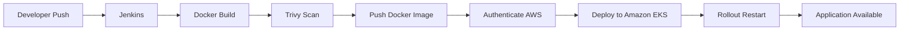

# 🎬 BookMyShow Clone – DevSecOps CI/CD & Amazon EKS Deployment

A production-grade, highly available deployment of a **BookMyShow Clone** demonstrating a complete **DevSecOps** workflow. The project leverages **Jenkins** for CI/CD, **Docker** for containerization, **Terraform** for Infrastructure as Code (IaC), **Ansible** for configuration management, and **Amazon EKS (Elastic Kubernetes Service)** for container orchestration.

Application traffic is exposed through an **AWS Network Load Balancer (NLB)** and mapped to a custom domain using **Amazon Route 53**.

---

## 📑 Table of Contents

1. Project Overview
2. Architecture Overview
3. Repository Structure
4. Infrastructure Provisioning (Terraform)
5. Kubernetes Configuration
6. CI/CD Pipeline
7. Troubleshooting

---

# 🎯 Project Overview

This project demonstrates an end-to-end **DevSecOps pipeline** capable of automatically building, scanning, deploying, and scaling a containerized React application on **Amazon EKS**.

### Key Features

| Feature | Description |
|---------|-------------|
| ☁️ Infrastructure as Code | AWS infrastructure provisioned using Terraform |
| ⚙️ Configuration Management | Automated server configuration with Ansible |
| 🐳 Containerization | Dockerized React application |
| ☸️ Kubernetes | High availability deployment on Amazon EKS |
| 📈 Auto Scaling | Horizontal Pod Autoscaler (HPA) |
| 🔄 CI/CD | Fully automated Jenkins pipeline |
| 🔒 DevSecOps | Trivy file system vulnerability scanning |
| 🌐 Networking | AWS Network Load Balancer + Route 53 |

---

# 🏗️ Architecture Overview

The application follows a cloud-native deployment architecture.

| Layer | Technology | Purpose |
|--------|------------|---------|
| 🎨 Frontend | React + Redux | Dynamic user interface and state management |
| ☁️ Infrastructure | Terraform | Provision AWS VPC, Subnets, Security Groups |
| ⚙️ Configuration | Ansible | Configure Kubernetes nodes |
| ☸️ Orchestration | Amazon EKS | Deploy and manage Kubernetes workloads |
| 📈 Scaling | Horizontal Pod Autoscaler | Automatically scale pods during traffic spikes |
| 🔄 CI/CD | Jenkins | Build, scan, push, and deploy containers |
| 🔒 Security | Trivy | File system vulnerability scanning |
| 🌍 Networking | AWS NLB + Route 53 | Internet-facing application access |

---

# 📂 Repository Structure

```text
bookmyshow-clone/
├── bookmyshow-app/
│   ├── public/
│   └── src/
│       ├── Components/
│       ├── Pages/
│       └── Redux/
│
├── kubernetes/
│   ├── deployment.yml
│   ├── hpa.yml
│   ├── node-port.yml
│   └── service.yml
│
├── Tf-script/
│   ├── main.tf
│   ├── provider.tf
│   └── resource.sh
│
├── playbook.yml
├── Dockerfile
└── Jenkinsfile
```

---

# ☁️ Infrastructure Provisioning (Terraform)

AWS infrastructure is provisioned using **Terraform** from the `Tf-script/` directory.

### Required Public Subnet Tag

```hcl
tags = {
  "kubernetes.io/role/elb" = "1"
}
```

This tag enables AWS to automatically provision an **internet-facing Network Load Balancer**.

### Deploy Infrastructure

```bash
cd Tf-script

terraform init

terraform apply -auto-approve
```

---

# ☸️ Kubernetes Configuration

## High Availability & Auto Scaling

The deployment maintains application availability while the **Horizontal Pod Autoscaler (HPA)** dynamically increases or decreases pod replicas based on CPU and memory utilization.

---

## AWS Network Load Balancer

The application is exposed externally using a Kubernetes **LoadBalancer Service** backed by an **AWS Network Load Balancer**.

```yaml
apiVersion: v1
kind: Service
metadata:
  name: bookmyshow-service
  annotations:
    service.beta.kubernetes.io/aws-load-balancer-scheme: "internet-facing"
    service.beta.kubernetes.io/aws-load-balancer-type: "nlb"

spec:
  type: LoadBalancer

  ports:
    - port: 80
      targetPort: 3000
      nodePort: 32745

  selector:
    app: bms
```

---

# 🔄 CI/CD Pipeline (Jenkins)

The Jenkins pipeline automates the complete deployment lifecycle.

## Pipeline Workflow

| Stage | Description |
|--------|-------------|
| 📦 Docker Build | Builds the Docker image from the application source |
| 🐳 Docker Push | Pushes versioned images to Docker Hub |
| 🔒 Trivy Scan | Performs file system vulnerability scanning |
| ☁️ AWS Authentication | Authenticates using AWS STS |
| ☸️ Deploy to EKS | Applies Kubernetes manifests |
| 🚀 Rollout Restart | Forces Kubernetes to pull the latest image |
| 📧 Notifications | Sends deployment status and Trivy reports via email |

---

## Deployment Flow



---

# 🔧 Troubleshooting

| Issue | Solution |
|--------|----------|
| Browser shows **"Took too long to respond"** | Access the application using **HTTP** until an ACM SSL certificate is attached to the NLB. |
| Jenkins email notifications fail | Verify the **System Admin Email**, disable **OAuth 2.0**, and configure a valid **Google App Password**. |

---

# 🚀 Future Scope

- Provision the EKS cluster using Terraform modules.
- Integrate SonarQube for static code analysis.
- Store secrets in AWS Secrets Manager.
- Replace Docker Hub with Amazon ECR.
- Implement Blue/Green deployments.
- Integrate Argo CD for GitOps deployments.
- Add Prometheus and Grafana monitoring.
- Secure ingress using AWS WAF and ACM TLS certificates.