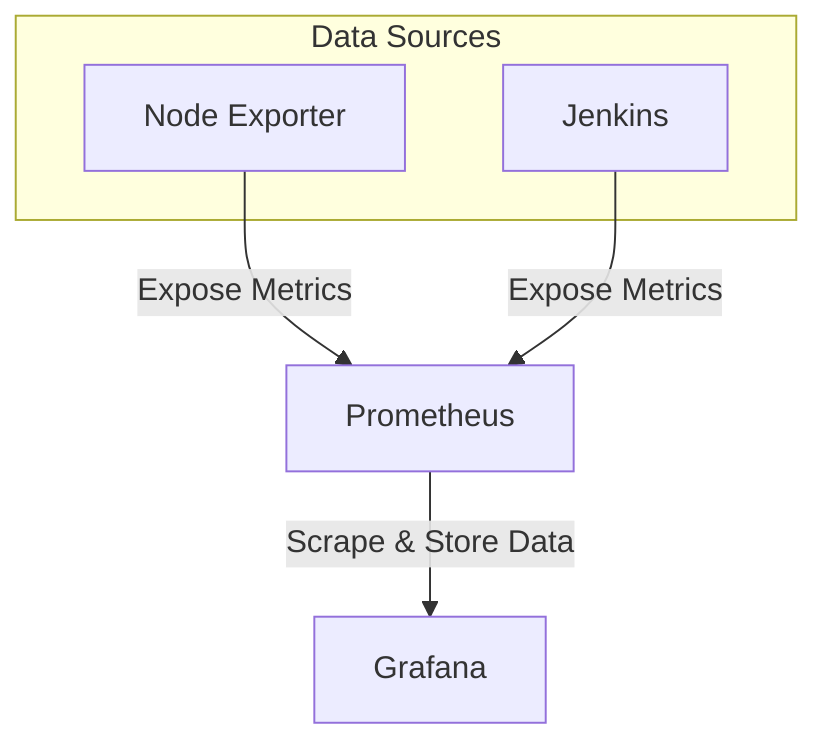

# 🎬 BookMyShow Clone – DevSecOps CI/CD & Amazon EKS Deployment

A production-grade, highly available deployment of a **BookMyShow Clone** demonstrating a complete **DevSecOps** workflow. The project leverages **Jenkins** for CI/CD, **Docker** for containerization, **Terraform** for Infrastructure as Code (IaC), **Ansible** for configuration management, and **Amazon EKS (Elastic Kubernetes Service)** for container orchestration.

Application traffic is exposed through an **AWS Network Load Balancer (NLB)** and mapped to a custom domain using **Amazon Route 53**.

---

## 📑 Table of Contents

1. Project Overview
2. Architecture Overview
3. Repository Structure
4. Infrastructure Provisioning (Terraform)
5. Kubernetes Configuration
6. CI/CD Pipeline
7. Troubleshooting

<br>

# 🎯 Project Overview

This project demonstrates an end-to-end **DevSecOps pipeline** capable of automatically building, scanning, deploying, and scaling a containerized React application on **Amazon EKS**.

### Key Features

| Feature | Description |
|---------|-------------|
| ☁️ Infrastructure as Code | AWS infrastructure provisioned using Terraform |
| ⚙️ Configuration Management | Automated server configuration with Ansible |
| 🐳 Containerization | Dockerized React application |
| ☸️ Kubernetes | High availability deployment on Amazon EKS |
| 📈 Auto Scaling | Horizontal Pod Autoscaler (HPA) |
| 🔄 CI/CD | Fully automated Jenkins pipeline |
| 🔒 DevSecOps | Trivy file system vulnerability scanning |
| 🌐 Networking | AWS Network Load Balancer + Route 53 |

<br>

# 🏗️ Architecture Overview


| Phase | Component / Technology | Action / Workflow Description |
|---|---|---|
| **☁️ 1. Infrastructure Provisioning** | **Terraform & AWS EC2** | Declaratively provisions the foundational AWS infrastructure (VPCs, Subnets, Security Groups) and bootstraps the primary server using `resource.sh` to automatically install Jenkins, Docker, and other CI/CD prerequisites. |
| **🔄️ 2. Pipeline Initiation** | **Jenkins & GitHub** | The pipeline is triggered manually or via webhook. Jenkins cleans the workspace and checks out the latest source code from the GitHub repository. |
| **🔍 3. Quality & Security (Shift-Left)** | **SonarQube** | Executes static code analysis to detect bugs and code smells, enforcing a Quality Gate to validate security thresholds before proceeding. |
| **⚛️ 4. Application Build** | **Node.js (NPM) & React** | Resolves and installs the necessary frontend packages and dependencies required for the React application. |
| **🛡️ 5. Vulnerability Scanning** | **OWASP & Trivy (Aqua)** | Performs an OWASP FS Scan to check for known open-source CVEs, followed by a Trivy FS Scan to audit the local file system for vulnerabilities and exposed secrets. |
| **🐳 6. Containerization** | **Docker & Docker Hub** | Compiles the validated application into a Docker container image. The image is tagged and pushed to Docker Hub for secure storage. |
| **🧪 7. Local Verification** | **Local Docker Runtime** | Deploys the freshly built image to a local container on the Jenkins agent to verify basic runtime stability before production deployment. |
| **☸️ 8. Cluster Deployment** | **AWS EKS & Kubernetes** | Jenkins applies the Kubernetes manifests (`deployment.yml`, `service.yml`) to deploy the containerized application across EKS worker nodes spanning `ap-south-1a` and `ap-south-1b`. |
| **🌐 9. Traffic Routing & Ingress** | **Amazon Route 53 & AWS NLB** | Client requests to `bookmyshow.threetierapp.click` are resolved by Route 53. Traffic is forwarded through a Kubernetes Service configured as an internet-facing Network Load Balancer: **TCP 80 → NodePort 32745 → Pod Port 3000**. |
| **📊 10. Observability & Monitoring** | **Prometheus & Grafana** | A dedicated Monitoring Server in `ap-south-1c` continuously collects metrics from EKS worker nodes using Prometheus. Grafana visualizes the collected metrics through interactive dashboards accessible on **Port 3000**. |
| **📩 11. Alerting & Notifications** | **Jenkins & Gmail** | A post-build action automatically sends rich HTML email notifications to administrators containing pipeline success/failure status and attached vulnerability reports. |


##  Services & Tool Stack

* **AWS EC2:** Virtual machines acting as the primary CI/CD server and a dedicated monitoring server.
* **AWS IAM & EKSCTL:** Used to securely provision and manage the Kubernetes control plane and worker nodes.
* **Jenkins:** Core CI/CD automation server orchestrating the build, security scanning, and deployment pipeline.
* **SonarQube:** Code quality and security analysis tool used to inspect application source code.
* **OWASP Dependency-Check:** Scans project dependencies for known publicly disclosed vulnerabilities and CVEs.
* **Trivy:** Vulnerability scanner used to inspect the application's file system for vulnerabilities and exposed secrets.
* **Docker & Docker Hub:** Used to containerize the application and securely store built container images.
* **Kubernetes (EKS):** Container orchestration platform managing application deployment, scaling, and networking.
* ** Prometheus & Node Exporter:** Used to collect and scrape hardware, OS, and Jenkins performance metrics.
* **Grafana:** Visualization and monitoring dashboard used to display metrics collected by Prometheus.
---
# 📂 Repository Structure

```text
bookmyshow-clone/
├── bookmyshow-app/
│   ├── public/
│   └── src/
│       ├── Components/
│       ├── Pages/
│       └── Redux/
│
├── kubernetes/
│   ├── deployment.yml
│   └── service.yml
│
├── Tf-script/
│   ├── main.tf
│   ├── provider.tf
│   └── resource.sh
│
├── Dockerfile
└── Jenkinsfile
```

---
<br>

# ⚡ Phase 1: Infrastructure Provisioning & IAM Setup

This phase establishes the foundational AWS infrastructure using **Terraform (Infrastructure as Code)** while implementing **IAM best practices** for secure cluster management.


## 🏗️ 1. Infrastructure as Code (Terraform)

The infrastructure is managed declaratively using **Terraform**, with all IaC files organized inside the `Tf-script/` directory.

### 📄 provider.tf

Initializes the AWS provider and defines the deployment region.

```hcl
provider "aws" {
  region = var.aws_region
}
```

**Purpose**

- Configures the AWS provider
- Uses variables for region selection
- Enables multi-region deployments with minimal changes

---

### 📄 Main.tf

This file acts as the **core infrastructure blueprint** responsible for provisioning the AWS environment.

#### Key Responsibilities

- Defines reusable variables (Region, Instance Type, Ports, etc.)
- Creates the networking layer (VPC, Subnets, Security Groups)
- Launches the **BMS-Server EC2 Instance**
- Uses **dynamic blocks** to simplify Security Group rules

#### Dynamic Security Group Rules

Instead of creating multiple ingress rules manually, Terraform dynamically generates them from a variable list.

```hcl
dynamic "ingress" {
  for_each = var.ingress_ports

  content {
    from_port   = ingress.value
    to_port     = ingress.value
    protocol    = "tcp"
    cidr_blocks = ["0.0.0.0/0"]
  }
}
```

**Benefits**

- Cleaner code
- Easier maintenance
- Highly scalable
- Eliminates repetitive ingress blocks

---

### 📄 resource.sh

The **bootstrap script** executed automatically when the EC2 instance is created.

It installs all required software for the DevSecOps environment without any manual intervention.

#### Automatically Installs

- AWS CLI
- Docker
- Jenkins
- Trivy
- Required system packages
- SonarQube Container: Spins up automatically on port 9000 after Docker installation using the command: ```docker run -d --name sonar -p 9000:9000 sonarqube:lts-community```.  

Terraform executes this script through the EC2 **User Data** feature.

```hcl
resource "aws_instance" "bms_server" {
  ami           = var.ami_id
  instance_type = "t2.large"

  user_data = file("resource.sh")

  tags = {
    Name = "BMS-Server"
  }
}
```

<br>

# 🔐 2. Identity & Access Management (IAM)

Instead of using the **AWS Root Account**, a dedicated **IAM User** is created for provisioning and managing the EKS cluster.

This follows the **Principle of Least Privilege (PoLP)** by granting only the permissions required for deployment.

## Attached IAM Policies

| IAM Policy | Purpose |
|------------|---------|
| **AmazonEKSClusterPolicy** | Allows Amazon EKS to manage AWS resources required by the cluster. |
| **AmazonEKSWorkerNodePolicy** | Enables worker nodes to securely communicate with the EKS Control Plane. |
| **AmazonEKS_CNI_Policy** | Grants the VPC CNI plugin permission to manage ENIs and Pod IP addresses. |
| **AmazonEC2FullAccess** | Allows provisioning and management of EC2 infrastructure. |
| **AWSCloudFormationFullAccess** | Required because `eksctl` provisions EKS resources using CloudFormation stacks. |
| **IAMFullAccess** | Creates IAM Roles, OIDC Providers, and Kubernetes Service Account Roles. |
| **Custom Inline Policy (`eks:*`)** | Grants complete EKS API permissions to prevent deployment restrictions during cluster creation. |

---
<br>

# ☸️ 3. Amazon EKS Cluster Creation & Management

### What is Amazon EKS?

**Amazon Elastic Kubernetes Service (EKS)** is a fully managed Kubernetes service that simplifies deploying, managing, and scaling containerized applications on AWS.

AWS manages the **Kubernetes Control Plane** (API Server, Scheduler, etcd, and Controller Manager) across multiple Availability Zones, while users provision **Worker Nodes** to run application workloads.


## 🔧 3.1 Required CLI Tools

Before creating the EKS cluster, the **BMS-Server** must have the required Kubernetes management tools installed.

Update the package index:

```bash
sudo apt update
```

---

### 📦 Install kubectl

`kubectl` is the official Kubernetes command-line tool used to communicate with the Kubernetes API Server.

```bash
# Download kubectl
curl -o kubectl https://amazon-eks.s3.us-west-2.amazonaws.com/1.19.6/2021-01-05/bin/linux/amd64/kubectl

# Make executable
chmod +x ./kubectl

# Move to system path
sudo mv ./kubectl /usr/local/bin

# Verify installation
kubectl version --short --client
```

**Purpose**

- Deploy Kubernetes resources
- Inspect cluster status
- Manage Pods, Deployments, Services, and Nodes
- Troubleshoot workloads

---

### 📦 Install eksctl

`eksctl` is the official CLI utility used to create and manage Amazon EKS clusters.

```bash
# Download latest release
curl --silent --location \
"https://github.com/weaveworks/eksctl/releases/latest/download/eksctl_$(uname -s)_amd64.tar.gz" \
| tar xz -C /tmp

# Install
sudo mv /tmp/eksctl /usr/local/bin

# Verify installation
eksctl version
```

**Purpose**

- Create EKS clusters
- Provision Worker Node Groups
- Configure IAM OIDC Provider
- Manage cluster lifecycle

<br>

# 🚀 3.2 EKS Cluster Provisioning Workflow

The cluster is provisioned in multiple stages to maintain better control over networking, security, and compute resources.


## 3.2. EKS Cluster Provisioning Workflow

### Step A: Create the EKS Control Plane Configuration File

To deploy the Kubernetes Control Plane into an existing custom VPC and specific subnets, use a declarative YAML configuration file instead of standard CLI flags.

Create a file named `cluster.yaml` and add the following configuration:

```yaml
apiVersion: eksctl.io/v1alpha5
kind: ClusterConfig

metadata:
  name: bookmyshow-eks
  region: ap-south-1
  version: "1.35"

vpc:
  id: vpc-0a84ab5d3307fc063
  subnets:
    public:
      ap-south-1a:
        id: subnet-09a377f0743a9588b
      ap-south-1b:
        id: subnet-0f7ae44eb379b6283

managedNodeGroups: []
```
### Configuration Parameter Breakdown

| Parameter | Description |
|---|---|
| `metadata` | Defines the cluster name (`bookmyshow-eks`), AWS region (`ap-south-1`), and Kubernetes version (`1.35`). |
| `vpc.id` | Instructs `eksctl` to use the existing custom VPC instead of creating a new VPC. |
| `vpc.subnets.public` | Maps the public subnets to `ap-south-1a` and `ap-south-1b`, connecting the cluster to the existing network architecture. |
| `managedNodeGroups: []` | Provisions only the control plane initially and prevents automatic worker-node creation, equivalent to `--without-nodegroup`. |

### Step B: Execute Cluster Creation

After saving `cluster.yaml`, provision the EKS cluster using:

```bash
eksctl create cluster -f cluster.yaml
```
> **Note:** Control Plane provisioning typically takes **5–10 minutes**.


<br>

## Step 2 — Associate IAM OIDC Provider (IRSA)

Enable **IAM Roles for Service Accounts (IRSA)** by associating an IAM OIDC Provider with the cluster.

```bash
eksctl utils associate-iam-oidc-provider \
  --region ap-south-1 \
  --cluster bookmyshow-eks \
  --approve
```

### Why IRSA?

- Enables Pods to assume dedicated IAM Roles
- Eliminates excessive node-level permissions
- Improves workload security
- Supports least-privilege access


## Step 3 — Create a Managed Worker Node Group

Provision the EC2 Worker Nodes that will host Kubernetes workloads.

```bash
eksctl create nodegroup \
  --cluster=bookmyshow-eks \
  --region=ap-south-1 \
  --name=node2 \
  --node-type=t3.medium \
  --nodes=3 \
  --nodes-min=2 \
  --nodes-max=4 \
  --node-volume-size=20 \
  --ssh-access \
  --ssh-public-key=bms \
  --managed \
  --asg-access \
  --external-dns-access \
  --full-ecr-access \
  --appmesh-access \
  --alb-ingress-access
```

### Node Group Configuration

| Parameter | Value |
|-----------|-------|
| Node Group | `node2` |
| Instance Type | `t3.medium` |
| Desired Nodes | `3` |
| Minimum Nodes | `2` |
| Maximum Nodes | `4` |
| Root Volume | `20 GB` |
| SSH Access | Enabled |
| Key Pair | `bms` |
| Node Type | AWS Managed Node Group |

### Additional IAM Permissions

The managed node group automatically receives permissions for:

- Auto Scaling
- Amazon ECR
- External DNS
- AWS App Mesh
- AWS ALB Controller

> **Note:** Worker Node provisioning typically completes within **5–10 minutes**.


## ✅ Outcome of Phase 1: Infrastructure & Cluster Provisioning

By completing this phase, the entire cloud foundation and Kubernetes platform are provisioned, secured, and ready for application deployment.

| Component | Outcome |
|-----------|---------|
| **🏗️ Automated Cloud Infrastructure** | AWS networking and the **BMS-Server EC2** instance are provisioned declaratively using **Terraform**. |
| **⚙️ Bootstrapped CI/CD Server** | `resource.sh` automatically installs **Docker, Jenkins, Trivy, SonarQube**, and other required DevOps tools. |
| **🔐 Secure IAM Configuration** | A dedicated **IAM User** with **least-privilege policies** manages AWS resources securely without using the Root Account. |
| **☸️ Amazon EKS Control Plane** | The **bookmyshow-eks** cluster is successfully created with **IAM OIDC Provider (IRSA)** enabled for secure pod-level authentication. |
| **🖥️ Managed Worker Nodes** | A managed **Node Group** with **Auto Scaling** is deployed and securely connected to the Kubernetes Control Plane. |
| **🚀 Deployment Ready** | The Kubernetes environment is fully configured and prepared for deploying application workloads and handling production traffic. |

<br>


# ⚙️ Phase 2: CI/CD Environment Setup

This phase focuses on configuring the **CI/CD server (Jenkins)** and the **code quality platform (SonarQube)** to automate application building, testing, security scanning, and deployment.

---

# 🔍 1. SonarQube Configuration

**SonarQube** performs **Static Application Security Testing (SAST)** and continuously analyzes the source code to identify:

- Bugs
- Security Vulnerabilities
- Code Smells
- Maintainability Issues

---

## SonarQube Setup

| Configuration | Details |
|--------------|---------|
| **Deployment** | Docker Container |
| **Container Name** | `sonar` |
| **Image** | `sonarqube:lts-community` |
| **Port** | `9000` |

```bash
docker run -d \
  --name sonar \
  -p 9000:9000 \
  sonarqube:lts-community
```

---

## Initial Access

| Property | Value |
|----------|-------|
| URL | `http://<EC2-Public-IP>:9000` |
| Default Username | `admin` |
| Default Password | `admin` |
| First Login | Mandatory password reset |

---

## SonarQube Authentication Token

A dedicated **User Token** is generated from **My Account → Security** and later stored securely in Jenkins Credentials.

Example: `squ_69eb05b41575c699579c6ced901eaafae66d63a2`


This token authorizes Jenkins to upload code analysis reports securely.

---

## Webhook Configuration

Configure a **Webhook** inside the SonarQube project settings that points to the Jenkins server.

This enables the Jenkins pipeline to use the `waitForQualityGate()` step, allowing the pipeline to pause until SonarQube completes code analysis and returns the Quality Gate result.

---

# 🚀 2. Jenkins Configuration

Jenkins serves as the central automation engine responsible for building, scanning, containerizing, and deploying the application.

---

## A. Required Jenkins Plugins

The following plugins extend Jenkins with Docker, Kubernetes, security scanning, and notification capabilities.

| Category | Plugins |
|----------|----------|
| **Java** | Eclipse Temurin Installer |
| **Code Quality** | SonarQube Scanner |
| **Node.js** | NodeJS |
| **Docker** | Docker, Docker Commons, Docker Pipeline, Docker API, docker-build-step |
| **Security** | OWASP Dependency Check |
| **Pipeline** | Pipeline Stage View |
| **Email** | Email Extension Template |
| **Kubernetes** | Kubernetes, Kubernetes CLI, Kubernetes Client API, Kubernetes Credentials |
| **Configuration** | Config File Provider |
| **Monitoring** | Prometheus Metrics |

---

## B. Global Tool Configuration

Configure build tools globally under **Manage Jenkins → Global Tool Configuration**.

| Tool | Configuration |
|------|---------------|
| **JDK** | `jdk17` |
| **NodeJS** | `node23` |

These tools are automatically injected into Jenkins pipelines during execution.

---

## C. Jenkins Credentials

Sensitive information is securely stored using **Manage Jenkins → Credentials**.

| Credential | Purpose | ID |
|------------|----------|----|
| Docker Hub Username & Password | Push Docker Images | `docker` |
| SonarQube Token | Code Quality Analysis | `Sonar-token` |
| Gmail App Password | Email Notifications | `email-creds` |

---

## D. Email Notification Configuration

Jenkins is configured to send automated pipeline notifications using **Gmail SMTP**.

| Setting | Value |
|---------|-------|
| SMTP Server | `smtp.gmail.com` |
| Port | `465` |
| Authentication | Gmail App Password |
| Credential ID | `email-creds` |
| Encryption | SSL |

### Build Notification Triggers

- ✅ Build Success
- ❌ Build Failure
- 🔄 Always

This provides developers with immediate feedback after every pipeline execution.

---

## ✅ Outcome of Phase 2

After completing this phase, the CI/CD environment is fully configured with:

- Jenkins automation server
- SonarQube code quality analysis
- Secure credential management
- Docker & Kubernetes integration
- Automated email notifications
- Production-ready CI/CD pipeline foundation

# Phase 3: CI/CD Pipeline Execution

In this phase, a **Jenkins Pipeline** automates the complete build, security scan, containerization, and deployment process for the application. Before execution, the Jenkins server is authenticated with AWS using `aws configure`, enabling secure access to the EKS cluster.

---

## Pipeline Workflow

| Stage | Purpose |
|--------|----------|
| Clean Workspace | Remove previous build artifacts |
| Git Checkout | Fetch latest source code |
| SonarQube Analysis | Static code quality & security scan |
| Quality Gate | Validate code quality |
| Install Dependencies | Install React packages |
| Build Docker Image | Containerize the application |
| OWASP Scan | Dependency vulnerability scanning |
| Trivy Scan | Filesystem vulnerability scanning |
| Push Docker Image | Publish image to Docker Hub |
| Local Container Test | Validate Docker image locally |
| Deploy to Amazon EKS | Deploy application to Kubernetes |
| Email Notification | Send deployment status |

---

## Stage 1: Code Checkout

Removes the previous workspace and downloads the latest application source code from GitHub.

### Jenkinsfile

```groovy
stage('Clean Workspace') {
    steps {
        cleanWs()
    }
}

stage('Checkout from Git') {
    steps {
        git branch: 'main',
            url: 'https://github.com/KastroVKiran/Book-My-Show.git'
        sh 'ls -la'
    }
}
```

**Outcome**

- Clean workspace
- Latest source code downloaded
- Ready for build

---

## Stage 2: Code Quality Analysis

Passes the codebase to the SonarQube server using the injected sonar-scanner tool and project keys to perform **static application security testing (SAST)**.

### Jenkinsfile

```groovy
stage('SonarQube Analysis') {
    steps {
        withSonarQubeEnv('sonar-server') {
            sh '''
            $SCANNER_HOME/bin/sonar-scanner \
                -Dsonar.projectName=BMS \
                -Dsonar.projectKey=BMS
            '''
        }
    }
}

stage('Quality Gate') {
    steps {
        script {
            waitForQualityGate(
                abortPipeline: false,
                credentialsId: 'Sonar-token'
            )
        }
    }
}
```

**Outcome**

- Detects bugs and vulnerabilities
- Validates code quality
- Prevents poor-quality code from progressing

---

## Stage 3: Dependency Installation

Navigates into the bookmyshow-app directory, safely removes any stale node_modules or package-lock.json files, and performs a fresh installation of necessary React frontend dependencies.

### Jenkinsfile

```groovy
stage('Install Dependencies') {
    steps {
        sh '''
        cd bookmyshow-app

        rm -rf node_modules package-lock.json

        npm install
        '''
    }
}
```

**Outcome**

- Removes stale packages
- Installs latest dependencies
- Ensures reproducible builds

---
## Stage 4. Build Docker Image

Changes to the bookmyshow-app directory containing the Dockerfile and builds the container image locally on the Jenkins agent.
```groovy
stage ("Build Docker Image") {
    steps {
        dir('bookmyshow-app') {
            sh "docker build -t bookmyshow-app ."
        }
    }
}
```

**Outcome**

- Docker image created successfully
- Application packaged for deployment

---

## Stage 5. OWASP Dependency Scan

Utilizes the OWASP Dependency-Check tool to scan the project dependencies for known, publicly disclosed vulnerabilities (CVEs).

```groovy
stage('OWASP FS Scan') {
    steps {
        dependencyCheck(
            additionalArguments: '--scan ./ --disableYarnAudit --disableNodeAudit',
            odcInstallation: 'DP-Check',
            nvdCredentialsId: 'nvd-api-key'
        )

        dependencyCheckPublisher(
            pattern: '**/dependency-check-report.xml'
        )
    }
}
```
### NVD API Integration

The scan integrates with the **National Vulnerability Database (NVD) API** using the configured `nvdCredentialsId: 'nvd-api-key'` credential.

This authenticated integration helps avoid public API rate limits, which can cause the vulnerability database update phase to stall. It also optimizes the pipeline by reducing the scan's database update time by approximately **70–80%**.

**Outcome**

- Dependency vulnerability report generated in XML
- Published within Jenkins

---

## Stage 6: Security Scan

Executes the **Trivy** vulnerability scanner against the local file system to detect critical security flaws or exposed secrets.

### Jenkinsfile

```groovy
stage('Trivy FS Scan') {
    steps {
        sh 'trivy fs . > trivyfs.txt'
    }
}
```

**Outcome**

- Detects vulnerabilities
- Generates `trivyfs.txt`
- Report attached to notification email

---

## Stage 7. Tag & Push Docker Image

Securely injects Docker credentials, logs into Docker Hub, and pushes the newly built image with both a dynamic build number tag and a latest backup tag.

```groovy
stage ("Tag & Push to DockerHub") {
    steps {
        script {
            withCredentials([
                usernamePassword(
                    credentialsId: "${DOCKER_CREDS}",
                    usernameVariable: 'DOCKER_USER',
                    passwordVariable: 'DOCKER_PASS'
                )
            ]) {

                sh "echo \$DOCKER_PASS | docker login -u \$DOCKER_USER --password-stdin"

                sh "docker tag bookmyshow-app ${IMAGE_REPO}:${IMAGE_TAG}"
                sh "docker push ${IMAGE_REPO}:${IMAGE_TAG}"

                sh "docker tag bookmyshow-app ${IMAGE_REPO}:latest"
                sh "docker push ${IMAGE_REPO}:latest"
            }
        }
    }
}
```

**Outcome**

- Image published to Docker Hub
- Versioned and latest tags maintained

---

## Stage 8. Local Container Deployment

Stops any existing local container instance and spins up the latest Docker image locally to verify runtime stability before Kubernetes deployment.

```groovy
stage('Deploy to Container') {
    steps {
        sh '''
        docker stop bookmyshow-app || true
        docker rm bookmyshow-app || true

        docker run -d \
            --restart=always \
            --name bookmyshow-app \
            -p 3000:3000 \
            ${IMAGE_REPO}:latest

        docker ps -a
        docker logs bookmyshow-app
        '''
    }
}
```

**Outcome**

- Local runtime validation completed
- A live, running container verifying that the Docker image executes correctly without immediate crashing
- Confirms image functionality

---


## Stage 9: Deploy to Amazon EKS

Authenticates the Jenkins agent with AWS STS, dynamically updates the kubeconfig for the bookmyshow-eks cluster, applies the necessary Kubernetes manifests, and forces a zero-downtime rollout restart.

### Jenkinsfile

```groovy
stage('Deploy to EKS Cluster') {
    steps {
        script {
            sh '''
            aws sts get-caller-identity

            aws eks update-kubeconfig \
            --name $EKS_CLUSTER_NAME \
            --region $AWS_REGION

            kubectl apply -f deployment.yml
            kubectl apply -f service.yml

            kubectl get pods
            kubectl get svc
            '''
        }
    }
}
```

**Outcome**

- Connects Jenkins to EKS
- Deploys Kubernetes manifests
- Verifies Pods and Services
- Application becomes accessible via configured Kubernetes service.

---

## Stage 10: Email Notification

Automatically sends build results along with the Trivy security report.

### Jenkinsfile

```groovy
post {
    always {
        script {
            emailext(
                attachLog: true,
                subject: "Build Status: ${currentBuild.currentResult}",
                body: "...",
                mimeType: 'text/html',
                to: 'vaibhavparte2@gmail.com',
                attachmentsPattern: 'trivyfs.txt'
            )
        }
    }
}
```

**Outcome**

- Sends build status email
- Attaches Jenkins console log
- Includes Trivy security report
- Provides direct build URL


## Phase 3 Outcome

After completing this phase:

- ✅ Source code automatically fetched from GitHub
- ✅ Static code analysis completed with SonarQube
- ✅ Quality Gate validation enforced
- ✅ Dependencies installed successfully
- ✅ Security vulnerabilities scanned using Trivy
- ✅ Docker image built and pushed to Docker Hub
- ✅ Application deployed to Amazon EKS
- ✅ Automated email notifications delivered with logs and security reports

<br>

# Phase 4: Monitoring & Observability

A dedicated monitoring stack using **Prometheus, Node Exporter, and Grafana** is implemented to monitor infrastructure health, Jenkins performance, and overall system availability.

---

## 1. Monitoring Server Provisioning

A separate monitoring environment is created to avoid resource contention with the application and CI/CD servers.

| Configuration | Value |
|---|---|
| **Instance Name** | `Monitoring Server` |
| **AMI** | Ubuntu 22.04 |
| **Instance Type** | `t2.medium` |
| **Purpose** | Prometheus, Node Exporter & Grafana |

---

## 2. Prometheus & Node Exporter Setup

**Prometheus** collects and stores time-series metrics, while **Node Exporter** exposes OS and hardware-level metrics.

### Secure User Creation

Dedicated system users are created without login access:

```bash
sudo useradd --system --no-create-home --shell /bin/false prometheus
sudo useradd --system --no-create-home --shell /bin/false node_exporter
```

### Prometheus

- Version: **v2.47.1**
- Binaries: `/usr/local/bin/`
- Configuration: `/etc/prometheus/`
- Port: `9090`
- Managed using **systemd**

### Node Exporter

- Version: **v1.6.1**
- Port: `9100`
- Managed using **systemd**
- Collects CPU, memory, disk, network, and OS metrics

Both services are enabled and started using:

```bash
sudo systemctl enable prometheus
sudo systemctl start prometheus

sudo systemctl enable node_exporter
sudo systemctl start node_exporter
```


## 3. Prometheus Target Configuration

Prometheus is configured to scrape metrics from **Node Exporter** and **Jenkins**.

### `prometheus.yml`

```yaml
- job_name: 'node_exporter'
  static_configs:
    - targets: ['<MonitoringVMip>:9100']

- job_name: 'jenkins'
  metrics_path: '/prometheus'
  static_configs:
    - targets: ['<your-jenkins-ip>:<your-jenkins-port>']
```

### • Configuration Validation

```bash
promtool check config /etc/prometheus/prometheus.yml
```

A successful validation returns:`SUCCESS`


### • Reload Prometheus

The configuration is reloaded without restarting the service:

```bash
curl -X POST http://localhost:9090/-/reload
```

### • Target Verification

Open:

```text
http://<your-prometheus-ip>:9090/targets
```

Expected target status:

| Target | Port | Status |
|---|---:|---|
| Node Exporter | `9100` | `UP` |
| Jenkins | Configured Port | `UP` |
| Prometheus | `9090` | `UP` |

---

## 4. Grafana Visualization

**Grafana** provides interactive dashboards for visualizing metrics to graph the raw time-series data collected by Prometheus.

### Installation

Required dependencies and the official Grafana repository are configured before installing Grafana through `apt`.

### Service Management

Grafana runs as a systemd service:

```bash
sudo systemctl enable grafana-server
sudo systemctl start grafana-server
```

### Dashboard Access

Grafana is accessible through:

```text
http://<monitoring-server-ip>:3000
```

Default credentials:

```text
Username: admin
Password: admin
```

> Change the default password after the initial login.

---

## Prometheus Data Source

Prometheus is configured as the primary Grafana data source.




## Grafana Dashboards

| Dashboard ID | Dashboard | Purpose |
|---:|---|---|
| **1860** | Node Exporter Full | CPU, RAM, Swap, Disk & Network monitoring |
| **9964** | Jenkins Performance & Health | Pipeline health, JVM uptime, executors & build status |

---

## Phase 4 Outcome

The monitoring environment now provides:

- ✅ **Prometheus** → Metric collection and time-series storage
- ✅ **Node Exporter** → Infrastructure and OS metrics
- ✅ **Grafana** → Interactive visualization and dashboards
- ✅ **Jenkins Metrics** → CI/CD pipeline monitoring
- ✅ **Systemd** → Automatic service startup and management
- ✅ **Dedicated Monitoring Server** → Isolated observability environment


# 🚀 Future Scope

- Provision the EKS cluster using Terraform modules.
- Integrate SonarQube for static code analysis.
- Store secrets in AWS Secrets Manager.
- Replace Docker Hub with Amazon ECR.
- Implement Blue/Green deployments.
- Integrate Argo CD for GitOps deployments.
- Add Prometheus and Grafana monitoring.
- Secure ingress using AWS WAF and ACM TLS certificates.